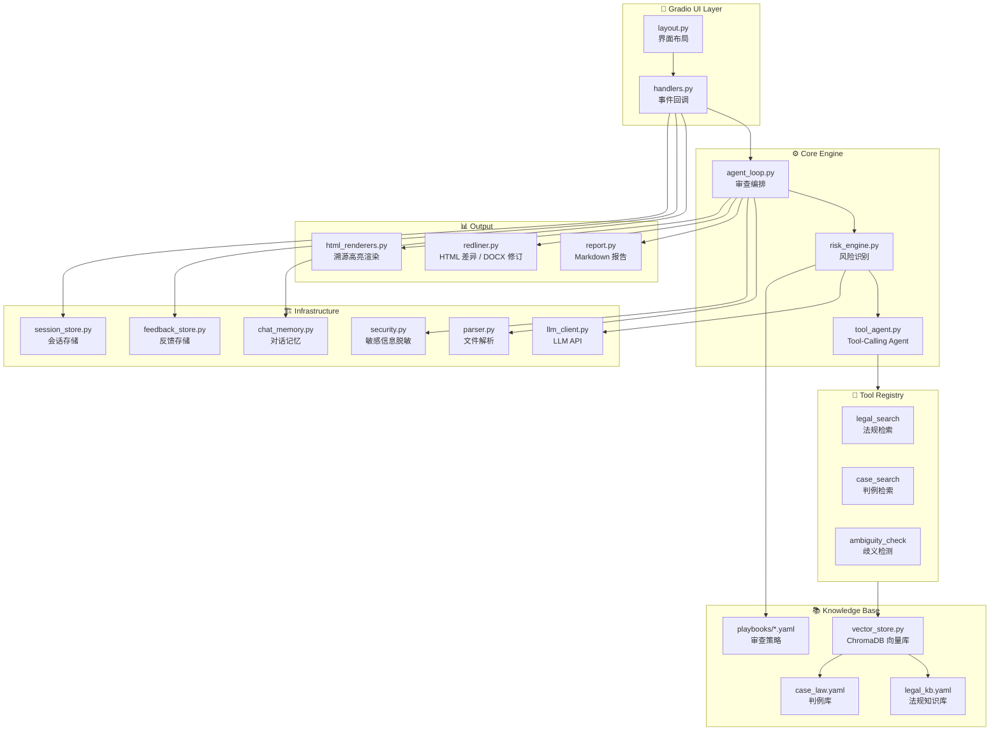
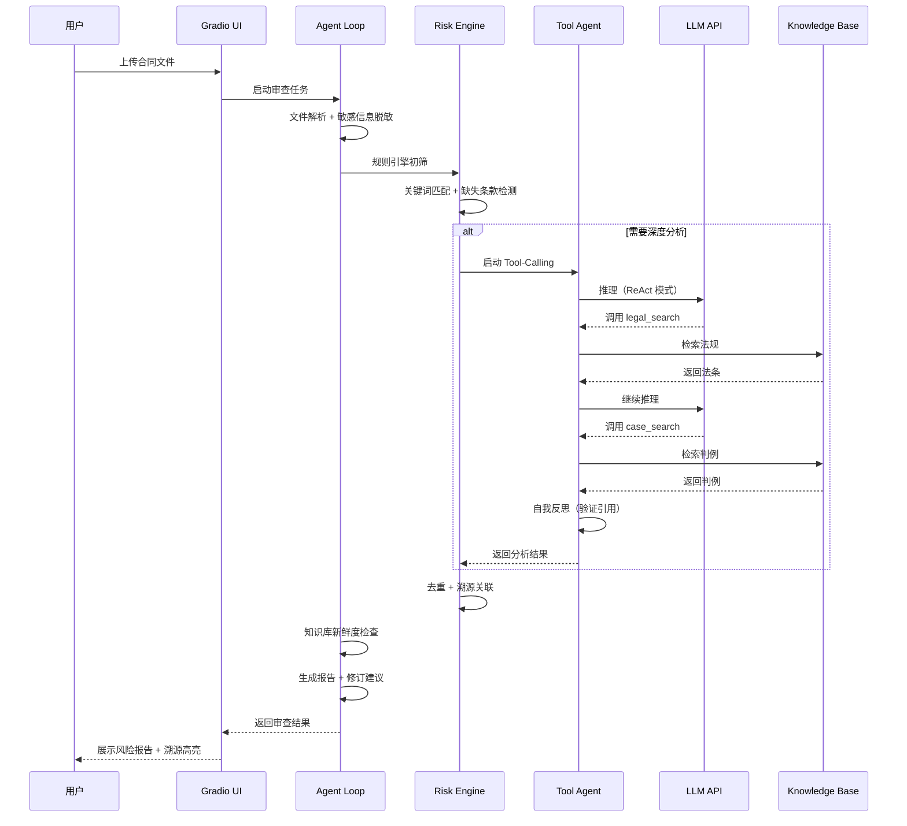

<div align="center">

# ⚖️ 法务审查 Agent v2.5

**基于 AI 的中文法律文件自动化风险识别与审查工具**

[](https://python.org)
[](https://gradio.app)
[](LICENSE)
[](tests/)

> ⚠️ **免责声明**: 本工具生成的审查结果不构成正式法律意见，仅供参考，需专业律师复核。

[功能特性](#-功能特性) · [快速开始](#-快速开始) · [架构设计](#-架构设计) · [在线演示](#-在线演示) · [更新日志](CHANGELOG.md)

</div>

---

## 📸 演示

<!-- 启动应用后截图，替换以下占位符 -->

| 上传审查 | 风险报告 | 修订追踪 |
|:---:|:---:|:---:|
|  |  |  |

| Tool-Calling 推理链 | 溯源高亮 | 反馈闭环 |
|:---:|:---:|:---:|
|  |  |  |

> 💡 截图说明：启动 `python app.py` 后在浏览器操作，使用 `examples/` 下的示例合同测试。

---

## 🚀 功能特性

### 核心能力

| 功能 | 说明 |
|------|------|
| 🤖 **Tool-Calling Agent** | ReAct 模式推理循环，AI 自主调用法规/判例检索工具，4 维停滞检测 + 自我反思验证引用准确性 |
| 🔍 **多路精准召回** | 向量语义检索 + 关键词扩展 + 法律术语强制召回（"定金"≠"订金"），三路融合排序 |
| 🔗 **溯源高亮** | 风险项 ↔ 原文条款双向跳转，展示条款位置、引用法条、置信度 |
| 🔄 **反馈闭环** | 用户标记误报/修正等级 → 反馈注入 LLM Few-shot → 下次不再犯同样错误 |
| 📅 **时效性检测** | 法条/判例状态标注、过期预警、知识库新鲜度报告 |
| 🎯 **多策略审查** | 甲方/乙方/中立/隐私合规/劳动合同，不同立场审查标准自动调整 |
| 📝 **修订追踪** | LLM 生成修订后文本，HTML 差异对比 + DOCX Track Changes 下载 |
| 🔒 **安全合规** | 敏感信息自动脱敏（身份证/手机/银行卡），超出能力范围自动转人工 |

### 支持的文件格式

| 格式 | 解析方案 |
|------|----------|
| PDF | pdfplumber |
| DOCX | python-docx（纯 Python） |
| DOC（WPS） | olefile → OLE 流提取（纯 Python，兼容 WPS） |
| TXT | 直接读取 |

---

## ⚡ 快速开始

### 方式一：本地运行

```bash
# 1. 克隆项目
git clone <your-repo-url>
cd legal-review-agent

# 2. 安装依赖
pip install -r requirements.txt

# 3. 配置 API 密钥
cp .env.example .env
# 编辑 .env，填入 LLM_API_KEY

# 4. 启动
python app.py
# 浏览器访问 http://localhost:7860
```

### 方式二：Windows 一键启动

```
双击 安装依赖.bat  →  双击 启动.bat
```

### 方式三：Docker

```bash
docker build -t legal-review-agent .
docker run -p 7860:7860 --env-file .env legal-review-agent
```

### 方式四：Hugging Face Spaces

详见 [DEPLOYMENT.md](DEPLOYMENT.md)

---

## 🏗️ 架构设计

### 系统架构



### Agent 审查流程



### 项目结构

```
legal-review-agent/
├── app.py                          # 应用入口（依赖注入 + 模块初始化）
├── requirements.txt
├── config/
│   ├── legal_rules.yaml            # 风险规则（60+ 条规则）
│   ├── legal_kb.yaml               # 法规知识库（含时效性标注）
│   ├── case_law.yaml               # 判例库
│   └── playbooks/                  # 审查策略
│       ├── party_a.yaml            # 甲方立场
│       ├── party_b.yaml            # 乙方立场
│       ├── privacy_compliance.yaml # 隐私合规
│       └── labor_contract.yaml     # 劳动合同
├── src/
│   ├── agent_loop.py               # 审查编排（进度管理 + 任务队列）
│   ├── tool_agent.py               # Tool-Calling Agent（ReAct + 自我反思）
│   ├── risk_engine.py              # 风险引擎（规则 + LLM 混合分析）
│   ├── legal_matcher.py            # 多路召回（语义 + 关键词 + 术语）
│   ├── vector_store.py             # ChromaDB 封装
│   ├── llm_client.py               # LLM 客户端（支持 Tool Calling）
│   ├── parser.py                   # 文件解析（PDF/DOCX/DOC/TXT）
│   ├── security.py                 # 敏感信息脱敏
│   ├── redliner.py                 # 修订追踪（HTML diff + DOCX）
│   ├── knowledge_freshness.py      # 知识库时效性检测
│   ├── feedback_store.py           # 人工反馈持久化
│   ├── chat_memory.py              # 多轮对话记忆
│   ├── handlers.py                 # Gradio 事件处理
│   ├── html_renderers.py           # HTML 渲染（溯源/思考过程）
│   ├── config.py                   # Pydantic Settings 配置
│   ├── exceptions.py               # 自定义异常体系
│   ├── logger.py                   # 结构化日志（审计 + LLM 链路）
│   ├── tools/                      # Agent 工具集
│   │   ├── base.py                 # 工具注册表
│   │   ├── legal_search.py         # 法规检索
│   │   ├── case_search.py          # 判例检索
│   │   └── ambiguity_check.py      # 歧义检测
│   └── ui/
│       └── layout.py               # Gradio 界面布局
├── tests/                          # 16 个测试文件
├── examples/                       # 示例合同（脱敏）
└── docs/screenshots/               # 演示截图
```

---

## 🔧 配置

### 环境变量

| 变量名 | 说明 | 默认值 |
|--------|------|--------|
| `LLM_API_KEY` | LLM API 密钥 | **必需** |
| `LLM_API_BASE` | API 端点 | `https://dashscope.aliyuncs.com/compatible-mode/v1` |
| `LLM_MODEL` | 模型名称 | `qwen-plus` |
| `MAX_FILE_SIZE_MB` | 最大文件大小 | `10` |

### 自定义审查策略

在 `config/playbooks/` 下创建 YAML 文件：

```yaml
id: "custom_strategy"
name: "自定义策略"
description: "策略描述"
role: "party_a"
strictness: "high"
focus_areas:
  - "违约责任"
  - "争议解决"
risk_weight_adjustments:
  "MISSING_CLAUSE_001":
    level: "critical"
    reason: "调整原因"
```

---

## 🧪 测试

```bash
# 运行全部测试
pytest tests/ -v

# 运行单个模块测试
pytest tests/test_risk_engine.py -v

# 查看覆盖率
pytest tests/ --cov=src --cov-report=html
```

---

## 📊 技术亮点

| 维度 | 实现 |
|------|------|
| **Agent 架构** | ReAct 循环 + 4 维停滞检测（重复调用/空结果/信息增益/推理收敛）+ 自我反思验证 |
| **检索策略** | 三路融合：ChromaDB 语义向量 + BM25 关键词 + 法律术语精确匹配 |
| **容错设计** | LLM 失败 → 规则分析 → 关键词匹配，三级降级不阻断 |
| **Token 优化** | 超长文档自动分段 + 历史消息压缩 + 工具结果截断，单次审查约 10K tokens |
| **安全合规** | 敏感信息自动脱敏 + API Key 环境变量管理 + 线程安全锁保护 |
| **配置驱动** | YAML 驱动规则引擎 + Pydantic Settings 类型验证，新增规则/策略无需改代码 |

---

## 📄 License

MIT

---

<div align="center">

**如果这个项目对你有帮助，请给一个 ⭐ Star！**

</div>
